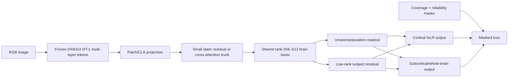

# Image-TRIBE: a label-free, static-image fMRI foundation encoder with affective generalization

**Research and implementation blueprint**  
**Audit date:** 2026-07-28  
**Scope:** human fMRI acquired during viewing of static natural images; image pixels are the only stimulus input to the proposed model. Emotion annotations are reserved for evaluation and are not used to train or select the primary checkpoint.

## Executive decision

This project is feasible, and the available data are now large enough for a serious test of the hypothesis. The right implementation is not a direct copy of TRIBE v2 and it should not use the current “image converted to a constant video” workaround.

The recommended model combines three existing ideas:

1. **Use MOSAIC as the data and preprocessing foundation.** MOSAIC already aggregates eight visual fMRI datasets with fMRIPrep, GLMsingle, fsLR-91k targets, provenance-aware stimulus handling, and a cross-dataset train/test split. Its full release contains 93 subject-dataset records, 430,007 stimulus–fMRI pairs, and 162,839 stimuli, although two constituent datasets are videos and must be excluded here ([MOSAIC project](https://blahner.github.io/MOSAICfmri/), [paper](https://doi.org/10.64898/2025.11.28.690060), [AWS data](https://registry.opendata.aws/mosaic/)).
2. **Use the useful generalization machinery from TRIBE v2.** Retain a shared latent brain basis, low-rank subject readouts, subject dropout, and an explicitly trained unseen/average-subject head. Do not retain the 100-second temporal Transformer for one-image/one-beta training ([TRIBE v2 paper](https://arxiv.org/abs/2605.04326), [code](https://github.com/facebookresearch/tribev2)).
3. **Add the image datasets that MOSAIC does not yet contain.** The highest priorities are NVD, LAION-fMRI, SemReps-8K, the natural-image sessions associated with ds004670, and CNeuroMod-THINGS. NVD contributes 20 participants and 106,080 presentations with an unusually useful shared/unique design. LAION-fMRI contributes five densely sampled participants, about 159,280 presentations, broad web-photo coverage, and roughly 300 scan-hours. SemReps and ds004670 together add approximately 123,000 image presentations and materially broaden COCO scene, material, and object coverage.

The strict label-free primary training pool should be:

- NSD;
- NOD;
- THINGS-fMRI1;
- CNeuroMod-THINGS;
- NVD;
- LAION-fMRI;
- SemReps-8K image trials;
- ds004670 natural-image sessions, including their linked ImageNet sessions.

This pool contains approximately **749,200 subject–image presentations** and a datasetwise upper bound of roughly **206,000 unique images before cross-dataset deduplication**. The true image union will be smaller because NSD, THINGS, ImageNet, COCO, and LAION comparison images overlap. These are scale estimates, not final manifest counts. SemReps caption and imagery trials and ds004670 illusion trials are excluded from these estimates.

Keep BOLD5000 out of the primary training pool because participants explicitly made like/neutral/dislike judgments and because independent affect ratings now exist for nearly every stimulus. This makes BOLD5000 much more valuable as a clean affective generalization test than as another 18,870 training trials.

The defensible scientific question is:

> Does affect-relevant neural prediction emerge as a function of generic image–fMRI scale and visual-semantic coverage, without affect labels, and does it explain measured affective brain variance beyond the source vision backbone and ordinary object/scene semantics?

This is stronger than asking whether emotion categories can be decoded from synthetic fMRI.

## 1. What is new relative to TRIBE v2, MOSAIC, and the current local tests

### 1.1 MOSAIC is the closest existing precursor

MOSAIC already implements the cross-study static-image aggregation that motivated this project. Its eight datasets are BOLD5000, DeepRecon, GOD, NSD, THINGS-fMRI, NOD, BOLD Moments, and Human Actions. The last two use videos. The six static-image datasets contribute 53 subject-dataset records before any new additions.

MOSAIC provides:

- the same fMRIPrep version across source datasets;
- GLMsingle single-trial beta estimates;
- full 91,282-grayordinate HDF5 targets;
- training-fold normalization and noise ceilings;
- a common stimulus manifest;
- a similarity-filtered cross-dataset split;
- downloadable data and model weights.

Its published brain-optimized baseline is an eight-layer CNN with a shared core and subject-specific factorized linear heads. A visual-cortex checkpoint predicts 7,831 vertices ([BERG/MOSAIC model card](https://brain-encoding-response-generator.readthedocs.io/en/latest/models/model_cards/fmri-mosaic-CNN8_multihead_subAll_verticesVisual.html)). This model is an essential comparator because a version of it is already part of the BERG ecosystem and because the user's earlier affective null result may already be evidence about the limits of the current MOSAIC architecture.

The proposed work is therefore an extension and a controlled scientific test, not the first multi-dataset image-fMRI merge.

### 1.2 The current local TRIBE image path is not a static-image model

The local code turns every still image into a constant four-second MP4 and sends it through the V-JEPA video route:

- [`predict_local.py`](N:/Experimental_Data/yujunchen/projects/Inhouse_encoding_model/TRIBEv2/scripts/predict_local.py:130) creates the MP4;
- [`predict_local.py`](N:/Experimental_Data/yujunchen/projects/Inhouse_encoding_model/TRIBEv2/scripts/predict_local.py:171) creates a `Video` event;
- [`run_iaps1182_tribev2_joint_predictions.py`](N:/Experimental_Data/yujunchen/projects/Inhouse_encoding_model/TRIBEv2_encoding_regression/src/run_iaps1182_tribev2_joint_predictions.py:94) repeats this protocol for IAPS;
- [`run_image_surface_regression.py`](N:/Experimental_Data/yujunchen/projects/Inhouse_encoding_model/TRIBEv2_encoding_regression/src/run_image_surface_regression.py:118) then averages timepoints by default.

The public TRIBE configuration uses text, audio, and V-JEPA video features. A DINOv2 configuration exists but is not included in `features_to_use` ([`defaults.py`](N:/Experimental_Data/yujunchen/projects/Inhouse_encoding_model/TRIBEv2/tribev2/grids/defaults.py:183)). The four-second local simulation also does not reproduce the paper's static-localizer protocol, which presents a one-second image and evaluates the predicted response around five seconds after onset.

Consequently, the present IAPS results are useful model-characterization maps, but they do not test held-out measured fMRI encoding and do not establish affective neural validity.

### 1.3 A single image and a single beta map change the architecture

TRIBE v2 is a continuous time-series model. A beta-level static-image dataset has the tensor contract:

```text
image features: [batch, layers, feature_dim, 1]
fMRI beta:      [batch, grayordinates, 1]
```

The existing low-rank and subject-conditioned predictor can operate at `T=1`. Self-attention over one temporal token, however, contributes almost nothing. The temporal Transformer, positional embeddings, fixed five-second shift, and sessionwise continuous-BOLD normalization should therefore be replaced rather than copied.

### 1.4 What the supplied results already establish

The [November 2024 NEM deck](<C:/Users/yujunchen/OneDrive - University of Florida/meeting_slides/20241117_NEM MD.pptx>) is internally consistent with a visual-confound explanation: balanced IAPS scene emotion is reported as null, object content remains decodable, faces are positive, and the later EmoSet/NAPS analyses explicitly warn that apparent emotion decoding can follow correlated visual features such as fire. The ViT comparison makes the same point: a powerful image representation can decode a label without proving that the predicted response contains neural affect information. The fwRF null does **not**, by itself, establish that recurrent feedback is necessary; it is also compatible with insufficient training diversity, visual-cortex-only targets, architecture mismatch, low target reliability, or the wrong static-image protocol.

The [February 2026 NSD deck](<C:/Users/yujunchen/OneDrive - University of Florida/meeting_slides/20260205_NSD_emotion.pptx>) reports above-chance unpleasant-versus-neutral and pleasant-versus-neutral pattern decoding in NSD responses, alongside group contrast maps. That is encouraging evidence that ostensibly generic natural-scene data can contain affect-relevant neural variation. It is not yet evidence that a generic encoding model reproduces that variation. The exact images used in those analyses must therefore become a locked NSD holdout before foundation training.

The “ERP?” labels in that deck should be renamed **fMRI multivoxel/ROI pattern decoding**. Spatial fMRI beta maps cannot establish an ERP or an LPP; the LPP requires time-resolved scalp EEG and a separate temporal model.

## 2. Primary hypotheses and falsification criteria

### H1 — Scale emergence

Prediction of affective fMRI patterns improves monotonically as generic, non-affect-labeled image–fMRI training data increase.

**Falsification:** generic visual encoding improves with scale, but all affective endpoints remain flat after measurement reliability is considered.

### H2 — Diversity matters beyond trial count

Cross-dataset visual-semantic diversity improves affective generalization more than an equal number of additional repetitions or object-heavy images.

**Falsification:** a size-matched single-dataset or object-only model performs as well as the diverse merged model.

### H3 — The brain mapping adds affect information beyond the image backbone

Predicted neural activity explains measured valence, arousal, affective category, or validated affect-signature expression after the source DINO features, CLIP/SigLIP features, faces, bodies, objects, scenes, luminance, contrast, and memorability are controlled.

**Falsification:** emotion decoding from predicted fMRI is no better than decoding directly from the frozen image backbone, or unique affect variance falls to zero after semantic covariates.

### H4 — Population and new-subject generalization

Subject dropout produces a meaningful population-average response for unseen people and enables few-shot individual calibration.

**Falsification:** performance requires a fully trained subject head and collapses for a held-out participant or held-out dataset.

### H5 — Scene/social coverage is especially important

NSD, NVD, LAION-fMRI, and other full-scene sources contribute more to affective transfer than equally sized isolated-object sources.

**Falsification:** source-dataset ablation and matched sampling show no special value of scene/social content.

### 2.1 Why label-free affect transfer is plausible—and bounded

The intended claim is not that pixels determine a person's private emotional state. It is that generic natural-image training may learn **affect-relevant stimulus and neural geometry incidentally** because people, actions, threats, rewards, social context, novelty, and goal relevance are already embedded in ordinary scenes and in the brain responses they evoke.

Four neuroscience results make that hypothesis reasonable:

| Framework or evidence | Prediction for Image-TRIBE |
|---|---|
| Emotion depends on interacting cortical–subcortical systems rather than a single emotion module ([Pessoa, 2017](https://doi.org/10.1016/j.tics.2017.03.002)) | Whole-cortex plus subcortical targets should transfer better than a visual-cortex-only model. A single-amygdala result is neither necessary nor sufficient |
| Valence has population codes that can generalize across stimuli, sensory modalities, and people, with modality-specific posterior and more abstract anterior representations ([Chikazoe et al., 2014](https://doi.org/10.1038/nn.3749)) | Generic images may support continuous valence geometry even when category labels were never supplied; test this across datasets and people rather than within one image set |
| Constructed-emotion/active-inference accounts treat emotion as distributed categorization using sensory context, concepts, and interoception ([Barrett, 2017](https://doi.org/10.1093/scan/nsw154)) | Large scene-semantic coverage can teach useful priors, but an image-only encoder has a principled ceiling because it lacks bodily state, goals, task instructions, and personal history |
| A distributed whole-brain signature predicts picture-induced negative affect across independent samples ([Chang et al., 2015](https://doi.org/10.1371/journal.pbio.1002180)) | PINES expression is a justified external endpoint, alongside image-level fMRI prediction; it should not replace prediction of measured responses |

The user's positive face-emotion result and null scene-emotion/LPP results are compatible with this boundary. Facial expressions contain visually diagnostic geometry that a vision backbone and face-selective cortex can preserve. Scene affect is more dependent on semantic relations, appraisal, motivation, and individual context. Therefore the primary target should be described as **generalization to affect-relevant evoked neural responses**, not mind-reading or complete reconstruction of emotional experience.

## 3. Search and inclusion criteria

The census used OpenNeuro's public dataset/API records, dataset repositories, primary dataset papers, official project sites, AWS Open Data, OSF/Figshare records, and reference chaining from recent large-scale image-fMRI descriptors. It was frozen on 2026-07-28.

The final bounded pass found no additional public corpus with at least 5,000 unique static natural images and usable fMRI beyond the primary/conditional sources listed below. Apparent large hits that use movies or face video were excluded rather than converted into independent frames.

A source qualifies for foundation training when it has:

1. human task fMRI;
2. static photographic or naturalistic images;
3. exact image-to-trial linkage;
4. sufficient unique images, repetitions, or people to add material information;
5. raw data or usable single-trial derivatives;
6. documented coverage and coordinate space;
7. stimulus access compatible with the research use;
8. no explicit affect labels used by the primary model.

Partial-FOV, highly repeated small image sets, artificial stimuli, face-only tasks, caption-primed images, and explicit affect experiments remain useful, but they have calibration or benchmark roles rather than being pooled indiscriminately.

## 4. Recommended dataset portfolio

### 4.1 Strict primary pretraining set

| Dataset | Scale and acquisition | Ready derivatives | Why it belongs | Required holdout or caution |
|---|---|---|---|---|
| [NSD](https://www.naturalscenesdataset.org/), [paper](https://doi.org/10.1038/s41593-021-00962-x), [AWS](https://registry.opendata.aws/nsd/) | 8 densely sampled people; about 9,000–10,000 COCO scenes/person; roughly 213,000 presentations; 7 T, 1.8 mm, TR 1.6 s | Prepared betas, native and template products, rich localizers | Best established richly annotated scene anchor; broad people/action/context content | Lock every local “NSD-emotion” image and its source family before training; reserve shared-image anchors; NSD/COCO research terms apply |
| [NOD ds004496](https://openneuro.org/datasets/ds004496/versions/2.1.2), [paper](https://doi.org/10.1038/s41597-023-02471-x) | 30 people; 57,000 unique ImageNet images plus 120 shared COCO images; about 67,800 presentations; 3 T, 2 mm, TR 2 s | fMRIPrep, native volume, ciftify fsLR-32k, surface GLM betas | Largest participant count and object diversity | Object-heavy; reserve the repeated COCO-120; exact ImageNet/COCO overlap audit required |
| [THINGS-fMRI1 ds004192](https://openneuro.org/datasets/ds004192/versions/1.0.7), [paper](https://doi.org/10.7554/eLife.82580) | 3 people; 8,740 unique images/720 concepts; 29,520 main-image presentations; 3 T, 2 mm, TR 1.5 s | Single-trial betas, ROIs, noise ceilings | Balanced concept coverage and repeated 100-image reliability set | Isolated-object bias; reserve repeated 100; original pixels are academic-use/password controlled. THINGSplus valence/arousal norms are evaluation metadata, not training labels |
| [CNeuroMod-THINGS](https://doi.org/10.1038/s41597-026-06591-y), [data/code](https://github.com/courtois-neuromod/cneuromod-things), [Zenodo](https://doi.org/10.5281/ZENODO.17881592) | 4 densely sampled people; 3,840–4,320 unique images/person, mostly three repeats; 50,400 presentations; 33–36 sessions; 3 T, 2 mm, TR 1.49 s | Raw/preprocessed data, GLMsingle betas, eye/physiology/localizers | Repeat-rich THINGS bridge and independent acquisition | Hash against THINGS-fMRI1; same 720 concepts and possible exact-pixel overlap; image rights inherit THINGS terms |
| [NVD ds007354](https://openneuro.org/datasets/ds007354/versions/2.0.1), [paper](https://doi.org/10.1038/s41597-026-07885-x), [repository](https://github.com/OpenNeuroDatasets/ds007354) | 20 people; 1,268 shared +500 unique/person; every image three repeats; 11,268-image inventory and 106,080 presentations; 5 T, 1.8 mm, TR 1 s | fMRIPrep T1w/MNI, fsLR-32k and 91k, GLMsingle trial and condition-average betas | Best new cross-person design; directly compatible with a common subject-conditioned encoder | Very new release: pin v2.0.1 and run release QA. Neural release is CC0; upstream COCO/Flickr pixel rights still need provenance handling |
| [LAION-fMRI](https://laion-fmri.hebartlab.com/) | 5 people; 25,052 distinct images; 6,204/person; about 31,856 presentations/person or 159,280 total; 30 main sessions/person; 7 T multi-echo, 1.8 mm, TR 1.9 s | Public raw/preprocessed fMRI, GLMsingle–tedana betas, captions/embeddings/segmentations, predefined splits | Broadest incidental natural-photo coverage; four to twelve repeats; approximately 60 h/person | Dataset paper pending; cite the VSS 2026 release. Images require a DUA and cannot be redistributed or used for general-purpose AI. It deliberately overlaps 240 NSD and multiple THINGS images |
| [SemReps-8K ds007272](https://openneuro.org/datasets/ds007272/versions/1.0.0), [paper](https://doi.org/10.7554/eLife.107933.3) | 6 people; 23,318 unique COCO images and 39,876 image presentations; 3 T, 3 mm, TR 2 s | Subject-space and fsaverage beta products plus exact COCO IDs | Large one-shot scene/social expansion; image and caption stimuli occur in separate, labeled trials | Keep only `trial_type=1`; model caption and imagery events in the GLM; reserve the shared 70-image repeated test set; COCO terms apply |
| [Visual Illusion Reconstruction ds004670](https://openneuro.org/datasets/ds004670/versions/1.0.0), [paper](https://doi.org/10.1126/sciadv.adj3906), [repository](https://github.com/OpenNeuroDatasets/ds004670), [processed data](https://doi.org/10.6084/m9.figshare.23590302) | 7 people; 3,200 natural images/person: 1,200 ImageNet objects, 1,000 FMD materials, and 1,000 COCO objects/scenes; about 83,200 planned natural-image presentations; 3 T, 2 mm, TR 2 s | Raw BIDS plus published preprocessed data/features | Adds material texture and full-scene diversity at useful repeat depth | Use natural-image sessions only. S1–S4 ImageNet sessions are stored in ds003430/ds001506; deduplicate subject/session/image rather than counting them as new data. Across-subject replacements make the union 3,232 images; source-specific pixel rights apply |

The total above is approximately 749,200 image presentations. Do not publish that as an exact training count until the final registry removes invalid trials, repeated test sets, source-image duplicates, and affect holdouts.

### 4.2 High-value evaluation and second-stage sources

| Dataset | Role | Decision |
|---|---|---|
| [BOLD5000 ds001499](https://openneuro.org/datasets/ds001499/versions/1.3.1), [paper](https://doi.org/10.1038/s41597-019-0052-3), [Gao ratings](https://doi.org/10.1038/s42003-025-08145-1) | 4 people, 4,916 images and 18,870 presentations spanning COCO, ImageNet, and SUN; scanner participants gave like/neutral/dislike responses, and later work collected 20-category emotion ratings for 4,913 images | Hold out the entire dataset for the primary affect test. Add it only to a post-evaluation maximum-scale checkpoint |
| [Caption Scene Dataset](https://doi.org/10.1038/s41597-026-07248-6), [data](https://doi.org/10.57760/sciencedb.27580), [code](https://github.com/lishurui0612/caption_scene_dataset) | 8 people; 9,117 core COCO-CN scenes; more than 4,400 caption–image trials/person; 210 functional scan-hours; shared and unique images with repeats | Context-conditioned ablation, not pure image pooling. Every image follows a Chinese caption, so its beta reflects language-guided visual processing. Violent/inappropriate content was screened out |
| [GOD ds001246](https://openneuro.org/datasets/ds001246/versions/1.2.1) and [DeepRecon ds001506](https://openneuro.org/datasets/ds001506/versions/1.3.1) | Different acquisitions of the exact same 1,250 ImageNet stimuli; 36,350 block observations across releases | Cross-scanner/task/category-OOD benchmark. Count pixels once, keep every identical image in one global fold, and do not use as a major scale source |
| [fast-fMRI object ds006616](https://openneuro.org/datasets/ds006616/versions/1.0.0) | 4 people, 642 THINGS images shown at 0.5-, 1-, and 4-s SOAs; partial occipital/temporal FOV; 7 T, TR 0.5 s | Timing and robustness benchmark, not whole-brain affect training |

### 4.3 Additional static-image benchmarks found in OpenNeuro

| Dataset | Useful question | Why not foundation training |
|---|---|---|
| [ds006805](https://openneuro.org/datasets/ds006805/versions/1.0.0) | Recurrence and difficult object recognition in 30 people | Only 242 images; excellent OOD test, insufficient unique-image scale |
| [ds004331](https://openneuro.org/datasets/ds004331/versions/1.0.4) | Natural photographs versus matched line drawings in 30 people | Moderate/small image inventory; best used for representational robustness |
| [ds005374](https://openneuro.org/datasets/ds005374/versions/1.0.1) | Age/category robustness | 64 images |
| [ds004693](https://openneuro.org/datasets/ds004693/versions/1.0.3) | Scene perception and recurrence | Limited scene set and partial-brain acquisition |
| [ds005226](https://openneuro.org/datasets/ds005226/versions/1.0.8) | Occlusion robustness in 65 people | 300 aircraft images; narrow and partly synthetic |
| [ds003661](https://openneuro.org/datasets/ds003661/versions/1.0.0), [paper](https://doi.org/10.1523/ENEURO.0443-17.2018) | Five-person natural-image training and blur robustness: 1,000 mutually exclusive ImageNet-category images/person plus 80 images at four blur levels | Conditional only: pixels are omitted for licensing and must be legally recovered from source identifiers; no ready single-trial betas |
| [vim-1/CRCNS](https://doi.org/10.6080/K0QN64NG) | Low-level retinotopic encoding and reliability | 2 people, grayscale images, occipital-only coverage, mixed stimulus rights |

### 4.4 Affective static-image tests — never primary generic training data

| Dataset | What it tests | Limitation |
|---|---|---|
| [Abdel-Ghaffar et al. natural emotional images](https://doi.org/10.1038/s41467-024-49073-8), [OSF](https://osf.io/b5pxu/) | 6 densely sampled people; 1,440 development images and a canonical 180-image independent test; individual valence/arousal plus semantic-affective structure | Strongest final external static affect benchmark; preserve the 180 untouched. Some source pixels, including IAPS, cannot be freely redistributed |
| BOLD5000 + Gao ratings | Everyday scene/object emotion schemas, continuous and categorical emotion, measured fMRI | Normative ratings are not the scanned person's state; must be entirely absent from primary training or held out by global source family |
| [ds001491](https://openneuro.org/datasets/ds001491/versions/1.0.0) | 20 people; 40 IAPS images crossing valence and arousal; exact image IDs and participant pleasantness/intensity ratings | Small and male-only; IAPS pixels restricted |
| [ds000009](https://openneuro.org/datasets/ds000009/versions/00002) and [ds000108](https://openneuro.org/datasets/ds000108/versions/00002) | Aversive/neutral IAPS viewing and regulation | Image linkage must be recovered before image-level encoding; older/coarser acquisition |
| [ds002620](https://openneuro.org/datasets/ds002620/versions/1.0.0) | 82 people; negative/neutral IAPS with suppress/enhance/passive instructions | No public image IDs/files in BIDS; condition-level validation only unless logs are recovered; do not double-count ds002366 |
| [ds004144](https://openneuro.org/datasets/ds004144/versions/1.0.2) | Emotion regulation and clinical domain shift in 66 women | IAPS linkage restrictions and fibromyalgia/control heterogeneity |
| [Food valuation ds007267](https://openneuro.org/datasets/ds007267/versions/1.1.1), [paper](https://doi.org/10.1038/s41597-026-07323-y) | 31 people; 568 Food-pics images/person and 17,512 image trials with trialwise “want to eat” ratings; tests appetitive value and reward-related vmPFC/striatal encoding | Narrow food/reward domain; ratings occur on every trial; raw BIDS requires single-trial beta estimation. Use as a locked value benchmark or later supervised adapter, not generic pretraining |
| [TMR/emotion ds005530](https://openneuro.org/datasets/ds005530) | 18 people ×48 exact-ID affective images with ratings | Useful small replication if event and stimulus metadata pass QA; the dataset's paper/citation status is weaker than the primary affect benchmarks |
| [Emotion faces ds003548](https://openneuro.org/datasets/ds003548) | 16 people ×40 Ekman faces; discrete-expression positive control | Face stimuli are absent/restricted and block/category structure limits image-level encoding; never use it as evidence of general scene affect |
| User's measured IAPS/NSD fMRI | Direct continuity with the current project | Any NSD test image must be quarantined before NSD enters pretraining |

Face-only emotion datasets remain positive controls, not the main claim. They test visible expression geometry more than general scene affect.

### 4.5 Explicit exclusions

- BOLD Moments, Human Actions, Horikawa emotion videos, NeuroEmo, Emo-FilM, Hyperface, and other moving stimuli belong in a temporal model, not the static-image primary model.
- Caption and mental-imagery trials from SemReps do not train the image-only head.
- CSD is not pooled as if it were passive vision.
- HCP-style localizers, small face sets, and repeated-category tasks are calibration data, not scale data.
- Repackagings of NSD, GOD, DeepRecon, or THINGS are not new neural data.
- Missing brain coverage is never represented by zero-valued targets.

## 5. Stimulus provenance and leakage control

Cross-dataset stimulus leakage is the largest avoidable threat to this paper.

Known overlap families include:

1. **COCO:** NSD, BOLD5000, NOD's shared set, NVD, SemReps, CSD, and ds004670.
2. **ImageNet:** NOD, BOLD5000, GOD, DeepRecon, and ds004670.
3. **THINGS:** THINGS-fMRI1, CNeuroMod-THINGS, fast-fMRI, and LAION-fMRI comparison images.
4. **Exact designed duplication:** GOD and DeepRecon use the same 1,250 images.
5. **Cross-repository participant duplication:** ds004670 points to ds003430 and ds001506 for S1–S4 ImageNet sessions. Those are one acquisition, not three datasets.
6. **Affect linkage:** Gao ratings use the exact BOLD5000 pixels.

Create an immutable `stimulus_registry` before any training. Minimum fields:

```text
study_id, subject_id, session, run, trial_id, repeat_id
source_corpus, source_image_id, source_url, source_license
image_path, file_sha256, decoded_pixel_sha256, perceptual_hash
crop_resize_lineage, width, height, color_space
CLIP_or_DreamSim_neighbor_cluster
task_id, onset, duration, response_context
target_path, target_row, source_brain_space, target_brain_space
scanner, field_strength, TR, preprocessing_version
coverage_mask, beta_noise_or_se, split, exclusion_reason
```

The split unit is the **source-image family**, not a filename or trial. Original images, alternate encodings, crops, resizes, and near duplicates always stay in the same partition.

Use source IDs first, decoded-pixel hashes second, perceptual hashes/SSIM third, and DreamSim/CLIP nearest-neighbor review fourth. Extend MOSAIC's similarity-filtered split across NVD, LAION-fMRI, CNeuroMod, and every affective benchmark.

## 6. Model: Image-TRIBE on the MOSAIC data layer

### 6.1 Input and target

- **Stimulus input:** one RGB image only.
- **Primary target:** a single-trial fMRI beta map in common fsLR-91k space.
- **Coverage:** separate cortical and subcortical masks; unobserved grayordinates are excluded from the loss.
- **Subject input:** a subject identifier during training or calibration; the primary zero-shot output uses the learned unseen/population head.
- **Nuisance metadata:** study/scanner/task gain and bias may be used during training to absorb measurement scale. They are not stimulus modalities and are fixed or marginalized for population inference.

### 6.2 Recommended architecture



Initial feature path:

```text
DINOv3 ViT-L layers [0.50, 0.75, 1.00]
→ concatenate projected CLS/global features
→ 2-layer residual MLP, width 1,152
→ rank 256 or 512 brain latent
→ unseen head + subject-specific low-rank residual, gain, and bias
→ cortical and subcortical outputs
```

As of this audit, [DINOv3](https://ai.meta.com/research/dinov3/) is the preferred primary backbone because it is self-supervised on unlabeled images and provides stronger global and dense features than the earlier release ([technical report](https://arxiv.org/abs/2508.10104)). Keep DINOv2-L as the preregistered compatibility baseline because TRIBE already references it and because newer computer-vision benchmarks do not guarantee better neural alignment. Choose between DINOv2 and DINOv3 using only generic fMRI validation. Use CLIP or [SigLIP2](https://arxiv.org/abs/2502.14786) as semantic-copy controls, not as the primary label-free backbone, because their image–text training can directly import human emotion concepts.

Stronger spatial model:

- retain DINO patch grids rather than averaging all spatial tokens;
- use 32–64 learned brain/ROI queries to cross-attend to patch features;
- share the query trunk across people and datasets;
- use a factorized readout to the full grayordinate target.

Use the global-feature version as the preregistered MVP and the patch model as an architecture ablation. This keeps the scientific scale test from depending on a complex new decoder.

### 6.3 Subject generalization

Use an explicitly trained unseen head and a residual subject adapter:

\[
W_s = W_{\text{unseen}} + A_s B_s .
\]

Set the residual to zero for a new person. Subject dropout of 0.1–0.3 forces the unseen head to receive training signal. A new person's adapter can then be calibrated using 50, 100, 200, or 500 shared-image responses.

This differs from a bank of unrelated full subject heads and gives a testable zero-shot/few-shot learning curve.

### 6.4 What to reuse from TRIBE v2

| TRIBE component | Decision for Image-TRIBE |
|---|---|
| Shared feature projector | Reuse conceptually |
| Low-rank bottleneck | Reuse; reduce initial rank to 256–512 for beta maps |
| Subject-conditioned output and subject dropout | Reuse and extend with an explicit unseen-head residual formulation |
| Pointwise MSE and Pearson evaluation | Reuse as baseline, adding masks and reliability weights |
| 100-s temporal Transformer | Replace with a small static trunk |
| V-JEPA repeated-frame input | Remove |
| Text and audio towers | Remove |
| Fixed five-second lag | Remove for beta targets |
| fsaverage5 public cortical-only checkpoint | Use only as an initialization ablation; main targets follow MOSAIC fsLR-91k and retain subcortex |

The released TRIBE continuous-BOLD head and the new beta head are different measurement models. TRIBE initialization or prediction distillation is an optional ablation, never the sole source of supervision.

## 7. Harmonizing the neural targets

### 7.1 Start from MOSAIC, do not redo its six image sources first

Download the subject HDF5 files and cross-dataset split from MOSAIC. Filter out BOLD Moments and Human Actions, and exclude BOLD5000, GOD, and DeepRecon from the strict primary checkpoint according to the roles above.

Convert NVD, LAION-fMRI, CNeuroMod, SemReps image trials, and ds004670 natural-image sessions to the same manifest/HDF5 contract. Prefer the MOSAIC versions of fMRIPrep 23.2.0 and GLMsingle 1.2 for a fully harmonized paper. A faster feasibility stage may use each author's provided beta products, provided that dataset-specific scaling is modeled and this shortcut is disclosed.

### 7.2 Target rules

- retain single trials for training;
- compute averaged-repeat maps only for reliability and evaluation;
- normalize each grayordinate from training-fold data within subject/study, never with test trials;
- preserve beta residual variance or standard error when available;
- never z-score a single image across grayordinates;
- carry a coverage mask per study/example;
- apply correct spherical registration when moving between fsaverage and fsLR;
- treat partial-FOV datasets as masked observations, not zeros.

### 7.3 Balanced sampling

Raw trial sampling would allow NSD, LAION, or highly repeated sets to dominate. Use:

```text
sample study with temperature p(study) ∝ N_study^0.5
→ sample subject uniformly within study
→ sample source-image family uniformly
→ sample one repeat/trial
```

Give every unique image approximately equal total weight within a person. Repeat-rich images contribute reliability, not twelve times the semantic importance.

### 7.4 Loss

Primary:

\[
L = \frac{\sum_{i,v} m_{iv} w_{iv}(\hat y_{iv}-y_{iv})^2}
         {\sum_{i,v}m_{iv}w_{iv}},
\]

where `m` is coverage and `w` is a capped reliability/inverse-variance weight.

Secondary ablations may use Huber loss, a small across-image correlation term, or repeat-consistency/RSA regularization. The primary result should not depend on an affective loss.

## 8. Frozen evaluation protocol: no affect leakage

### 8.1 Partition governance

Create five disjoint registries:

1. `generic_train`
2. `generic_validation`
3. `generic_final_test`
4. `affect_development`
5. `affect_final_locked`

Only generic validation controls early stopping, architecture, and hyperparameters. Freeze the checkpoint before opening the affect-final labels or results.

Recommended locked final tests:

- Abdel-Ghaffar canonical 180;
- an entirely held-out BOLD5000/Gao test, preferably the full dataset for the strict model;
- the user's real IAPS fMRI;
- a predeclared NSD-emotion image list that is removed from every NSD/COCO source before training.

### 8.2 Generic encoding endpoints

- per-grayordinate across-image Pearson correlation;
- cross-validated \(R^2\);
- noise-normalized \(R^2\);
- per-image spatial-pattern correlation;
- retrieval accuracy;
- known-person/new-image, new-person/known-image, new-person/new-image, and held-out-study results;
- cortical and subcortical ROI performance;
- calibration curves versus 0/50/100/200/500 new-person images.

### 8.3 Affective neural endpoints

Evaluate real and predicted neural responses with the same predeclared pipeline:

1. continuous valence and arousal encoding;
2. emotional versus neutral and high- versus low-arousal contrasts;
3. discrete category decoding only as a secondary endpoint;
4. neural representational similarity to affect ratings;
5. validated affect-signature expression, including PINES where the target space supports it;
6. image-level spatial-pattern prediction in visual cortex, amygdala, insula, vmPFC/OFC, hippocampal/medial temporal, temporal pole, and social-perceptual ROIs;
7. semantic × affect variance partitioning.

Use participant and stimulus as crossed random effects or bootstrap both levels. All folds group repetitions and source-image families.

### 8.4 The crucial semantic-copy controls

For every affect result compare:

- raw pixels/low-level features;
- frozen DINOv2 and DINOv3 features;
- CLIP or another semantic backbone;
- published MOSAIC CNN8 predictions;
- Image-TRIBE predictions;
- measured fMRI;
- an affect-supervised model as a positive ceiling, not as the primary model.

Nuisance features should include faces, bodies, people count, object labels, scene labels, luminance, contrast, saturation, spatial frequency, memorability, and source dataset.

An emotion decoder operating on Image-TRIBE predictions is not evidence of neural affect if the same performance is already present in DINO/CLIP/SigLIP or if predicted fMRI does not match the measured affective pattern.

## 9. Experiments that answer “scale or affective experience?”

Train the same architecture under a preregistered matrix:

| Factor | Levels |
|---|---|
| Number of generic paired observations | 25k, 50k, 100k, 200k, 400k, full |
| Dataset diversity | one dataset; size-matched multi-dataset; full multi-dataset |
| Content regime | object-heavy; scene/social-balanced without affect labels; full natural distribution |
| Backbone/readout | MOSAIC CNN8; frozen DINOv2/v3 ridge; independent subject heads; shared Image-TRIBE |
| Subject mechanism | separate heads; shared head; subject dropout + residual adapter |
| Target | visual cortex; whole cortex; cortex + subcortex |

Primary comparisons:

1. **Scale curve:** affective performance versus generic paired observations.
2. **Diversity curve:** equal trial count, one versus many source datasets.
3. **Coverage ablation:** leave out NSD, NVD, LAION, NOD, or THINGS sources one at a time.
4. **Architecture ablation:** published MOSAIC CNN8 versus static DINO/subject-dropout model.
5. **No-label test:** no human/pseudo affect label enters training, selection, early stopping, or dataset balancing.
6. **Optional adapter ceiling:** after the primary result is frozen, train a small affective adapter on the Abdel-Ghaffar development set and quantify how much explicit emotional neural data adds.

This design can distinguish four outcomes:

| Result | Interpretation |
|---|---|
| Generic and affective performance both scale | Evidence for label-free affective emergence |
| Generic scales, affect does not | Scale alone is insufficient; paired affective neural experience is needed |
| Affect improves only with scene-rich sources | Incidental affect coverage, not raw scale, is the key ingredient |
| Predicted affect decodes but adds nothing beyond DINO/CLIP/SigLIP | Semantic copying, not a learned neural affect representation |

## 10. Practical build order

### Phase 0 — registry and locked tests

- Freeze the exact BOLD5000/Gao, Abdel-180, user-IAPS, and NSD-emotion image lists.
- Build source-ID, SHA256, decoded-pixel hash, pHash, and DreamSim/CLIP duplicate checks.
- Record neural-data and stimulus-pixel licenses separately.
- Pin every dataset snapshot and preprocessing version.

**Exit criterion:** no source-image family crosses train/validation/final boundaries.

### Phase 1 — reproduce existing baselines

- Download the image-only MOSAIC HDF5 subset.
- Reproduce the published MOSAIC CNN8 score on its test set.
- Run frozen DINOv2 and DINOv3 ridge plus per-subject linear/MLP baselines.
- Correct the current TRIBE static protocol for comparison: one-second image, blank interval, predicted sample around five seconds.

**Exit criterion:** baseline numbers match published/released references within expected tolerance.

### Phase 2 — Image-TRIBE MVP

- Direct DINOv3 image extractor; no MP4. Retain DINOv2 as a fixed backbone ablation.
- Global-token model, rank-256/512 latent, masked beta loss.
- MOSAIC's strict generic datasets first: NSD, NOD, THINGS.
- Train shared, separate-head, and subject-dropout variants.

**Exit criterion:** Image-TRIBE exceeds frozen-DINO ridge and is at least competitive with MOSAIC CNN8 on generic held-out fMRI.

### Phase 3 — extend the consortium

- Add NVD v2.0.1.
- Add SemReps image trials after filtering `trial_type=1` and locking its 70 repeated images.
- Add ds004670 natural-image sessions, resolving its linked ds003430/ds001506 acquisitions without duplication.
- Add CNeuroMod-THINGS with THINGS deduplication.
- Add LAION-fMRI after DUA acceptance and snapshot pinning.
- Keep CSD as language-guided vision, not untagged pure vision.

**Exit criterion:** leave-one-dataset-out and unseen-person performance improves without calibration drift.

### Phase 4 — locked affect evaluation

- Freeze weights and all analysis choices.
- Open affect-final data.
- Run neural prediction, affect signatures, variance partitioning, and semantic controls.
- Bootstrap subjects and source-image families.

**Exit criterion:** determine which of the four interpretation outcomes in Section 9 is supported.

### Phase 5 — optional affective adapter

Only after the label-free paper result is frozen, train a small low-rank adapter on affect-rich measured fMRI. This gives a supervised ceiling and a direct test of whether emotional neural experience contributes beyond generic scale.

## 11. Paper plan

### Primary paper

**Working title:** *Does affective neural encoding emerge from scale? A label-free cross-study image-to-fMRI foundation model*

Core contributions:

1. an image-only extension of a harmonized fMRI consortium;
2. a TRIBE-style unseen-person encoder for single-trial beta maps;
3. rigorous global image-family leakage control;
4. scale, diversity, and scene-coverage experiments;
5. external affective validation beyond backbone semantics.

Minimum figures:

1. dataset composition, overlap graph, and locked split;
2. model architecture and population/subject heads;
3. generic scaling and held-out-dataset results;
4. affective scaling curves;
5. real versus predicted affective maps/signatures;
6. semantic × affect variance partitioning;
7. source-dataset and subject-generalization ablations.

The project remains publishable if the result is negative. A carefully controlled finding that 700k+ generic image–fMRI observations improve ordinary vision encoding but fail to recover measured affect after semantic controls would be strong evidence that scale alone is insufficient.

## 12. Important scope boundary: fMRI cannot test the LPP

This model predicts fMRI. It can test affective BOLD patterns, validated fMRI signatures, distributed affect geometry, and cortical/subcortical encoding. It cannot establish an EEG late positive potential.

For an eventual LPP study, reuse the frozen image backbone and shared semantic latent, but train a separate real-EEG temporal head extending beyond 1.5 seconds. Test 300–600 ms and 600–1,500+ ms centroparietal responses on measured EEG. Do not infer LPP validity from fMRI predictions.

## 13. Immediate recommendation

Begin with a three-source proof of concept using the already harmonized MOSAIC versions of NSD, NOD, and THINGS. Hold BOLD5000 out. Implement the direct DINO beta model and subject-dropout population head. Once it beats the released MOSAIC CNN8 and frozen-DINO baselines on generic held-out data, add NVD, SemReps, ds004670, CNeuroMod, and finally LAION-fMRI after its DUA. Only then open the locked affective tests.

That sequence tests the central hypothesis with the smallest amount of new preprocessing while preserving a credible final paper.
